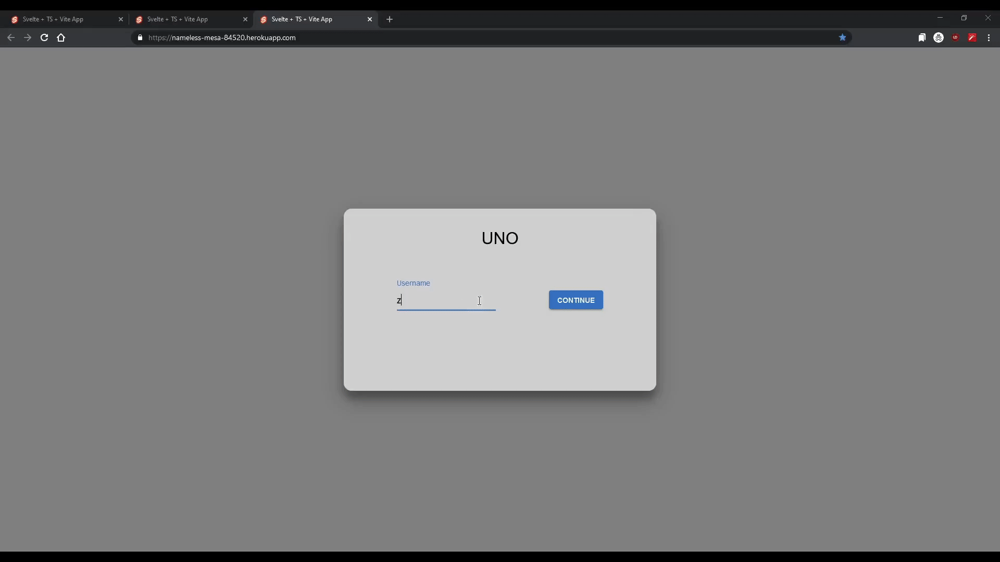

# Uno Game (Svelte)

A simple UNO game built with Svelte.  
Play online with 2 to 4 players

## Online Multiplayer

- Create or join a room via a lobby link
- Real-time gameplay with WebSockets
- responsive UI

### Creating a Lobby

- Create a username
- select the number of players for the game
- create a lobby
- share the link

### Joining a Room

- Create a username
- Paste the room ID
- Click join button

### Game Layout

A simple example of the gameplay

### Disclaimer

This project was originally hosted on Heroku.services. However, since Heroku has removed its free tier, the app will need to be migrated to another platform.

### React

Same project but made on react:
https://github.com/realDPS/UnoReact
